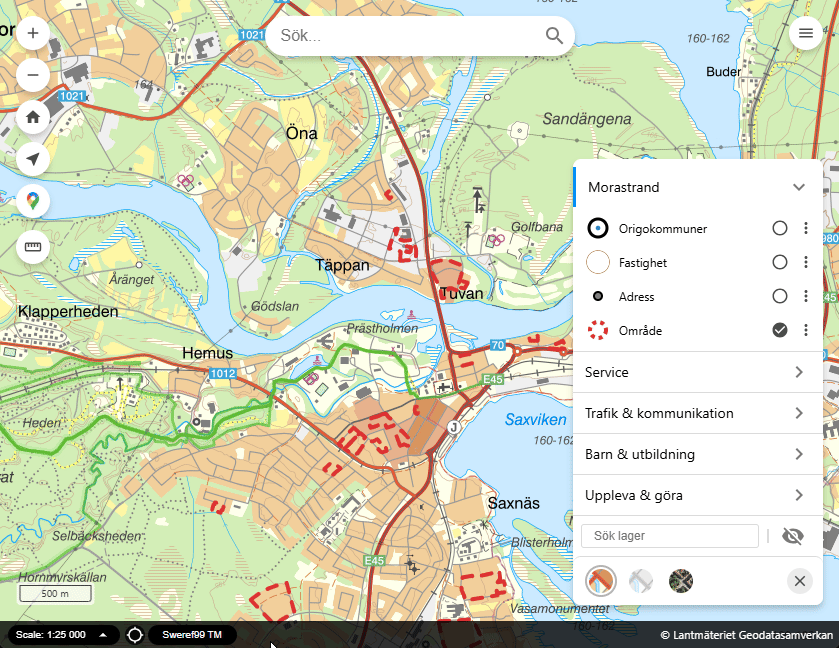

# layer-search-filter-plugin

`layer-search-filter-plugin` adds layer-specific search and filter actions to the
legend property panel. It can search remote layers through WFS, search loaded
features in local vector-like layers, and search the enabled descendants of an
Origo group layer.

Use it when users need to search within a layer or layer group instead of using
the global map search.



## Quick start

## Download built files [here](https://nightly.link/Kristianstad/layer-search-filter-plugin/workflows/build/main/layersearch-built-assets.zip).

### Load the plugin in `index.html`

Add the plugin stylesheet inside `<head>`:

```html
<link href="plugins/layer_search_filter/layer_search_filter.css" rel="stylesheet">
```

Load the plugin bundle after Origo and before the script that initializes the
map. Register the global `LayerSearchFilter` factory with Origo:

```html
<script src="js/origo.js"></script>
<script src="plugins/layer_search_filter/layer_search_filter.min.js"></script>
<script>
  var origo = Origo('index.json', {
    controls: {
      layer_search_filter: LayerSearchFilter
    }
  });
</script>
```

Use `layer_search_filter.min.js` instead when the host should load the minified
production bundle. Both bundles expose the same global factory.

### Configure the plugin in `index.json`

Add both `legend` and `layer_search_filter` to the `controls` array. Options that
use their defaults can be omitted:

```json
[
  {
    "name": "legend",
    "options": {
      "expanded": true
    }
  },
      {
      "name": "layer_search_filter",
      "options": {
        "filterType": "auto",
        "minLength": 2,
        "limit": 100,
        "zoomToExtentLimit": 5000,
        "featureInfoForResultsLimit": 250,
        "layerSearchEnabled": true,
        "title": "Sök i lager",
        "placeholder": "Sök i detta lager",
        "buttonText": "",
        "showLayerVisibilityButton": true,
        "showFilterButton": true,
        "showZoomToResultsButton": true,
        "showFeatureInfoForResultsButton": true,
        "queryableOnly": false,
        "activateLayerOnSuggestionClick": false,
        "includeExistingCqlFilter": true,
        "searchableAttributes": "layer"
      }
    }
]
```


### Runtime assets

The plugin ships these public JavaScript and CSS files:

- `plugins/layer_search_filter/layer_search_filter.js`
- `plugins/layer_search_filter/layer_search_filter.min.js`
- `plugins/layer_search_filter/layer_search_filter.css`

These committed compatibility artifacts keep existing host URLs stable. Their
source of truth is `src/` and `scss/`; do not edit the root JavaScript or CSS
files by hand.

## Capabilities

The plugin lets users:

- search all discovered attributes, configured display attributes, or an exact
  per-layer search allowlist;
- select one or more attribute chips and a compatible text or numeric operator;
- see debounced suggestions while typing, or refresh them with the form's search
  button;
- click a suggestion to show the feature on the map and, for a queryable layer,
  open feature information;
- explicitly highlight and zoom to matching features;
- explicitly open feature information for multiple matching features;
- apply the search as a temporary map-layer filter and restore the previous
  filter or style when it is cleared;
- toggle layer visibility and close or reopen the search without losing its
  layer-specific state; and
- optionally restrict remote WFS searches to the current map extent.

Text operators support case-insensitive contains and starts-with matching plus
case-sensitive equality. Numeric operators support equality, greater than,
less than, and an inclusive range. Geometry, date, and boolean attributes are
not offered as searchable attributes.

## Supported search and filter paths

| Target | Search path | Temporary layer-filter path |
| --- | --- | --- |
| Remote WFS- or WMS-backed layer | WFS 1.1.0 `DescribeFeatureType` and GeoJSON `GetFeature` requests using `CQL_FILTER` or QGIS `EXP_FILTER` | WMS CQL parameter, QGIS WMS vector-overlay fallback, or a source `setFilter` API |
| Origo `GEOJSON` layer, including URL-backed, inline, and clustered sources | Loaded source features returned by `getFeatures()`; URL-backed sources are loaded before discovery/search | Client-side style filter that preserves and restores the layer's original style |
| Other local vector-like layer | Loaded source features returned by `getFeatures()` | Client-side style filter when the layer exposes `getStyle()` and `setStyle()` |
| Origo `GROUP` layer | Enabled descendant layers are searched in parallel; results are merged and deduplicated | The compatible filter path is applied independently to each enabled descendant |

For a remote WMS layer, the configured service URL must also accept the WFS
requests used for discovery and search. A group can combine remote and local
descendants.

### GeoJSON layers

Layers with `type: GEOJSON` always use the client-feature path, even when
their `source` is a URL or a named map source with a URL. The plugin does not
append WFS parameters or run CQL/QGIS dialect detection against the GeoJSON
file. It waits for the OpenLayers source to finish loading, then uses the same
in-memory features for suggestions, zoom-to-results, feature info, and the
temporary style filter.

No additional plugin options are required:

```json
{
  "name": "origo-cities",
  "title": "Origokommuner",
  "source": "data/origo-cities-3857.geojson",
  "style": "origo-logo",
  "type": "GEOJSON",
  "attributes": [
    { "name": "name" }
  ],
  "visible": true
}
```

The feature-info result action is available when the Origo feature-info service
is present and the layer's `queryable` setting is explicitly `true`.

## Requirements

The plugin requires the Origo `legend` control. A searchable target must provide
one of the following:

- a resolvable source URL and a WFS-compatible service that returns GeoJSON
  `GetFeature` results, with `DescribeFeatureType` or a sample feature available
  for attribute discovery; or
- an Origo `GEOJSON` source that can load its features or already contains inline
  features; or
- another local source with loaded features and a `getFeatures()` method.

Remote services must support GeoServer-style CQL or QGIS expressions. The
browser must be allowed to reach the service, including through CORS when it is
on another origin.

The Origo `featureInfo` control is optional. It is required for suggestion clicks
or the multi-result feature-info action to open feature information, and the
corresponding target layer must have `queryable: true`.

The plugin is developed and tested with the Origo source and dependencies in
this repository. It does not declare an independent Origo version range.

## Runtime flow

1. The plugin listens to the legend's `renderOverlayProperties` event.
2. When a layer property panel is rendered, it injects a search activation
   button if the layer has at least one enabled search target.
3. On activation, it resolves the target layer or group descendants and
   discovers attributes. Remote discovery tries `DescribeFeatureType` first and
   merges a GeoJSON feature sample when needed. Origo `GEOJSON` layers wait for
   their local OpenLayers source to load and then inspect a loaded feature.
4. It shows only operators and attribute chips compatible with the discovered
   string and numeric types.
5. Typing is debounced. The plugin builds the active CQL/QGIS expression or
   performs equivalent client-side matching, then renders suggestions.
6. The form's search button refreshes suggestions. Zoom/highlight,
   feature-info, and layer filtering are separate action buttons.
7. An active temporary layer filter is marked with a dot on the layer's legend
   symbol and can be cleared to restore the original filter or style.

## Configuration reference

| Option | Default | Description |
| --- | --- | --- |
| `name` | `"layer_search_filter"` | Plugin/control name. Normally this should not be changed. |
| `minLength` | `2` | Minimum length for contains searches. Starts-with and equality searches accept one character, while valid numeric operator input is searched regardless of character count. |
| `limit` | `20` | Maximum number of live suggestions after results from all target layers have been merged. |
| `debounceDelay` | `300` | Delay in milliseconds before running a search after typing. |
| `title` | `"Sök i lager"` | Accessible label/title for the search form. |
| `suggestionsTitle` | `"Sökresultat"` | Title shown above the suggestion list. The number of currently displayed suggestions is appended in parentheses after each search. |
| `placeholder` | `"Sök i detta lager"` | Placeholder text in the search input. |
| `buttonText` | `""` | Text shown on the activation button. If empty, the button is icon-only. |
| `attributeFilterTitle` | `"Sökbara attribut"` | Heading for the discovered attribute filter buttons. The number of currently visible attributes is appended in parentheses. |
| `loadingText` | `"Söker..."` | Message shown while a search is running. |
| `discoveringAttributesText` | `"Läser attribut..."` | Message shown while attributes are being discovered. |
| `noAttributesText` | `"Kunde inte hitta några sökbara attribut för lagret."` | Message shown when no searchable attributes can be found. |
| `noResultsText` | `"Inga träffar."` | Message shown when the search returns no results. |
| `typeMoreText` | `"Skriv minst {{minLength}} tecken."` | Message shown when the search text is too short. `{{minLength}}` is replaced by the configured minimum length. |
| `searchErrorText` | `"Det gick inte att söka i lagret."` | Message shown when a search fails. |
| `unsupportedLayerText` | `"Lagret saknar källa som kan sökas."` | Message shown when no target has either a resolvable remote source URL or loaded local features. |
| `filterActionsTitle` | `"Lageråtgärder"` | Accessible label for the action button row under the search field. |
| `showLayerVisibilityButton` | `true` | If `false`, hides the layer visibility/activate layer action button. |
| `showFilterButton` | `true` | If `false`, hides the round layer filter action button. |
| `showZoomToResultsButton` | `true` | If `false`, hides the zoom-to-results action button. |
| <code>zoomToResultStatusText</code> | <code>{{count}} träff markerad.</code> | Success message shown when the zoom action processes one matching feature. <code>{{count}}</code> is replaced by the number of highlighted features. |
| <code>zoomToResultsStatusText</code> | <code>{{count}} träffar markerade.</code> | Success message shown when the zoom action processes multiple matching features. <code>{{count}}</code> is replaced by the number of highlighted features, capped by <code>zoomToExtentLimit</code>. |
| `showFeatureInfoForResultsButton` | `true` | If `false`, hides the feature-info-for-results action button. The button is also hidden unless the layer, or at least one searched child layer in a group, has `queryable: true`. |
| <code>featureInfoResultStatusText</code> | <code>{{count}} objekt markerat.</code> | Status message shown when the feature-info action marks one object. <code>{{count}}</code> is replaced by the number of objects sent to the infowindow. |
| <code>featureInfoResultsStatusText</code> | <code>{{count}} objekt markerade.</code> | Status message shown when the feature-info action marks zero or multiple objects. <code>{{count}}</code> is replaced by the number of objects sent to the infowindow. |
| <code>featureInfoResultsLimitReachedText</code> | <code>Maximalt antal ({{limit}}) har nåtts; det kan finnas fler träffar.</code> | Appended to the feature-info status when the number of marked objects reaches <code>featureInfoForResultsLimit</code>. <code>{{limit}}</code> is replaced by that effective limit. |
| `showCloseSearchButton` | `true` | If `false`, hides the bottom-right close action button for the expanded search UI. |
| `layerVisibleTitle` | `"Släck lagret"` | Accessible label/title for the layer visibility button when the layer is visible. |
| `layerHiddenTitle` | `"Tänd lagret"` | Accessible label/title for the layer visibility button when the layer is hidden. |
| `layerLockedTitle` | `"Lagret är låst"` | Accessible label/title for the layer visibility button when the layer is secure/locked. |
| `filterButtonTitle` | `"Filtrera lagret"` | Accessible label/title for the round filter button. |
| `zoomToResultsButtonTitle` | `"Markera och zooma till träffar"` | Accessible label/title for the action that highlights matching features and fits the map to their extent. |
| `featureInfoForResultsButtonTitle` | `"Visa info för träffar"` | Accessible label/title for the action that opens feature info for matching queryable features. |
| `closeSearchButtonTitle` | `"Stäng sökning"` | Accessible label/title for the close action shown on the same bottom row as status messages. |
| `filterActiveTitle` | `"Ta bort lagerfilter"` | Accessible label/title while the layer filter is active. |
| `filterUnsupportedText` | `"Lagret kan inte filtreras här."` | Message shown when the current layer type/source cannot be filtered. |
| `filterAppliedText` | `"Lagret är filtrerat."` | Status text used after applying the layer filter. |
| `filterClearedText` | `"Lagerfiltret är borttaget."` | Status text used after clearing the layer filter. |
| `searchOperator` | derived from `searchMode`, `textMatchMode`, and `numericComparisonMode` | Default dropdown operator. Use `"ilike"`, `"startsWith"`, `"equals"`, `"greaterThan"`, `"lessThan"`, or `"between"`. |
| `searchOperatorTitle` | `"Sökalternativ"` | Accessible label/title for the shared operator dropdown. |
| `textMatchContainsTitle` | `"Sökning: innehåller, oavsett stora eller små bokstäver"` | Accessible label/title for the case-insensitive contains text operator. |
| `textMatchStartsWithTitle` | `"Sökning: börjar med"` | Accessible label/title for the starts-with text operator. |
| `textMatchContainsOptionText` | `"Innehåller"` | Dropdown option text for case-insensitive contains matching. |
| `textMatchStartsWithOptionText` | `"Börjar med"` | Dropdown option text for starts-with matching. |
| `numericComparisonEqualsTitle` | `"Jämförelse: lika med"` | Accessible label/title for the shared string and numeric `=` operator. The option name is kept for backwards compatibility. |
| `numericComparisonGreaterThanTitle` | `"Numerisk jämförelse: större än"` | Accessible label/title for `>`. |
| `numericComparisonLessThanTitle` | `"Numerisk jämförelse: mindre än"` | Accessible label/title for `<`. |
| `numericComparisonBetweenTitle` | `"Numerisk jämförelse: mellan"` | Accessible label/title for between. |
| `numericComparisonEqualsOptionText` | `"Lika med"` | Dropdown option text for `=`. |
| `numericComparisonGreaterThanOptionText` | `"Större än"` | Dropdown option text for `>`. |
| `numericComparisonLessThanOptionText` | `"Mindre än"` | Dropdown option text for `<`. |
| `numericComparisonBetweenOptionText` | `"Mellan"` | Dropdown option text for between. |
| `numericComparisonNeedsNumberText` | `"Skriv ett numeriskt värde för jämförelsen."` | Message shown when numeric search is active but the input is not numeric. |
| `numericComparisonBetweenNeedsNumberText` | `"Skriv två numeriska värden för mellan."` | Message shown when between is active but either value is missing or not numeric. |
| `numericComparisonNoAttributesText` | `"Välj ett numeriskt attribut för jämförelsen."` | Message shown when numeric search is active but the active attributes contain no numeric field. |
| `numericComparisonBetweenStartPlaceholder` | `"Från"` | Placeholder for the first value when `Mellan` is active. |
| `numericComparisonBetweenEndPlaceholder` | `"Till"` | Placeholder and accessible label for the second value when `Mellan` is active. |
| `layerSearchEnabled` | `true` | Default for adding the layer search UI to layers. Set `false` on the control to disable it by default, or set `true`/`false` on a layer to override the default for that layer. |
| `queryableOnly` | `false` | If `true`, target layers explicitly configured with `queryable: false` are excluded. Layers without a `queryable` setting remain eligible. A group can still search its remaining eligible descendants. |
| `activateLayerOnSuggestionClick` | `true` | If `true`, clicking a result suggestion makes the target layer and containing group visible before zooming or opening feature info. Set to `false` to keep hidden layers hidden while still zooming/highlighting the clicked feature. |
| `includeExistingCqlFilter` | `true` | If `true`, existing layer/source filters are combined with the generated CQL filter or QGIS expression using `AND`. The option name is kept for backwards compatibility. |
| `filterType` | autodetect | Default filter dialect for layers and sources that do not set their own `filterType`. Use `"cql"` for GeoServer CQL or `"qgis"` for QGIS Server `EXP_FILTER`. Omit the option to auto-detect the dialect. |
| `searchableAttributes` | `"all"` | Which attributes can be searched and shown as attribute chips. Use `"all"` for all operator-compatible discovered attributes, or `"layer"` to use only layer `attributes` entries with a `name` confirmed by WFS/local discovery. `"configured"` is a legacy alias for `"layer"`. Attribute chips use the plain-text content of `title` when present, replace HTML tags with spaces, collapse repeated whitespace, fall back to `name`, and are sorted A-Ö. If the layer has no configured attributes, `"layer"` falls back to `"all"`. |
| `layerSearchAttributes` | unset | Layer-level exact allowlist that overrides `searchableAttributes` for that leaf layer. Entries use the same `name`, optional `title`, and optional `type` fields as layer `attributes`, but do not control feature-info display. An empty array exposes no searchable attributes. |
| `useCurrentExtent` | `false` | If `true`, the current map extent is sent as a WFS `BBOX` parameter. It has no effect on local searches. |
| `maxRequestQueryLength` | `1800` | Maximum request query string length before WFS searches are split into shorter `GetFeature` requests or long WMS filters switch to POST image loading. |
| `maxZoomLevel` | map resolution count minus 2 | Maximum zoom level used when zooming to search results or opening feature info. |
| `zoomToExtentLimit` | `1000` | Maximum number of features requested when calculating the result extent for zooming. Useful when `limit` is lower than the total result count. |
| `wmsOverlayFilterLimit` | value of `zoomToExtentLimit` | Maximum number of WFS features drawn in the temporary overlay fallback used for QGIS WMS image layer filtering. |
| `featureInfoForResultsLimit` | value of `zoomToExtentLimit` | Maximum number of features opened by the feature-info-for-results action. If this is lower than `limit`, only the first matching results up to this value are sent to the infowindow. The status message warns when this maximum is reached, because additional matches may exist. |
| `zoomPadding` | `[50, 50, 50, 50]` | Padding used when fitting the map view to result features. |
| `highlightStyleOptions` | 5 px solid blue point; blue/white line and polygon styles | Style options used for highlighted point, line, and polygon features. |
| `highlightZIndex` | `10` | Z-index for the highlight layer. |
| `localization` | `undefined` | Optional Origo localization object. If provided, labels are read using the plugin name as the parent key. |


## Layer configuration notes

The plugin uses the active layer, or each eligible descendant of an active
group, to resolve search data, request parameters, and filter behavior.

### Source URL

The source URL is resolved first from the layer's named source configuration and
then, when needed, from the OpenLayers source's `getUrls()` or `getUrl()`
method. A typical source configuration looks like this:

```json
{
  "source": {
    "geoserver_wfs": {
      "url": "https://example.com/geoserver/wfs"
    }
  }
}
```

And a layer can reference it like this:

```json
{
  "name": "places",
  "title": "Places",
  "source": "geoserver_wfs",
  "type": "WFS",
  "queryable": true,
  "visible": false
}
```

The plugin sends WFS requests to the resolved URL and sets parameters such as:

- `service=WFS`,
- `version=1.1.0`,
- `request=DescribeFeatureType` or `request=GetFeature`,
- `typeName=<layer id or name>`,
- `outputFormat=application/json`,
- `srsName=<map projection>`,
- `CQL_FILTER=<generated CQL filter>` for CQL servers, or
- `EXP_FILTER=<generated QGIS expression>` for QGIS Server,
- `BBOX=<extent>,<projection>` when `useCurrentExtent` is enabled.

Generated CQL filters double-quote every attribute name and escape embedded
double quotes. This keeps ordinary property names working while also supporting
GeoServer/ECQL reserved names such as `id`.

Entries in the source configuration's `queryParams` object are copied to every
WFS URL. Use this for stable service parameters such as a public token; do not
put secrets in browser configuration.

For GeoJSON responses, the plugin reads the response `crs` when present. If no CRS is declared, the first real feature geometry coordinate is used before any GeoJSON bbox metadata: lon/lat-like coordinates are read as `EPSG:4326`, while projected coordinates are read as the map projection requested with `srsName`. The bbox is only used as a fallback when no feature geometry coordinate is available, because some QGIS/WFS responses mix a lon/lat collection bbox with projected feature geometry.

### Layer name and type name

The WFS `typeName` is taken from the layer id if available, otherwise from the layer name. Make sure the layer name matches the WFS type name expected by the service.

### Filter dialect detection

By default, the plugin auto-detects whether each layer should use CQL or QGIS Server expressions. Detection starts in the background when the layer search field is opened, in parallel with attribute discovery. It first makes a lightweight unfiltered WFS `GetFeature` request with `maxFeatures=1`, then tests `CQL_FILTER=1=0` and only accepts CQL if the service returns an empty result for a layer that otherwise has features. If CQL fails or appears to be ignored, it tests QGIS Server filtering with `EXP_FILTER=1=0`. The detected dialect and any in-progress detection request are reused per source URL and type name, so typing before detection completes does not start duplicate probe requests.

Set `filterType` to `"cql"` or `"qgis"` on the plugin options to use that dialect as the default for layers that do not set their own dialect. More specific configuration wins in this order: layer `filterType`, source `filterType`, plugin option `filterType`, then autodetection.

```json
{
  "name": "layer_search_filter",
  "options": {
    "filterType": "qgis"
  }
}
```

A source or layer can still override the plugin default. For example, this uses QGIS expressions by default but forces one GeoServer source to CQL:

```json
{
  "controls": [
    {
      "name": "layer_search_filter",
      "options": {
        "filterType": "qgis"
      }
    }
  ],
  "source": {
    "qgis_wfs": {
      "url": "https://example.com/qgisserver/wfs"
    },
    "geoserver_wfs": {
      "url": "https://example.com/geoserver/wfs",
      "filterType": "cql"
    }
  }
}
```

QGIS WFS searches use `EXP_FILTER` with QGIS expressions. For QGIS WMS image layers, the round layer-filter action uses the filtered WFS response as a temporary vector overlay, hides the original WMS layer while the filter is active, and restores it when the filter is cleared. This avoids claiming that a QGIS `GetMap` image is filtered when the server ignores or rejects WMS filter parameters.

### Long request handling

When a generated WFS search URL would exceed `maxRequestQueryLength`, the plugin splits the searchable attributes into several shorter `GetFeature` requests and merges duplicate features client-side. This applies to normal suggestions, zoom-to-results, and feature-info-for-results actions.

When a CQL WMS layer filter would make `GetMap` query strings too long, the plugin keeps the same `CQL_FILTER` parameter but switches supported OpenLayers WMS sources to POST image/tile loading while the filter is active. Clearing the filter restores the previous WMS load function. The older `maxWfsQueryLength` option is still accepted as an alias.

### Group layers

For an Origo `GROUP` layer, the plugin recursively targets eligible leaf
descendants. Attribute discovery is merged across those descendants, searches
run in parallel, and duplicate results are removed before the shared `limit`
is applied. Suggestion rows identify the descendant layer when it differs from
the open group.

Result actions operate on matching descendant features, while temporary
filtering is applied independently to each compatible descendant. A search
failure in one descendant does not discard results from the others.

### Queryable layers

`queryableOnly` excludes only targets explicitly configured with
`queryable: false`. An omitted setting remains eligible for search, but feature
information requires `queryable: true`.

| Layer `queryable` setting | Searched when `queryableOnly: false` | Searched when `queryableOnly: true` | Feature information available |
| --- | --- | --- | --- |
| Explicit true (`true`) | Yes | Yes | Yes, when the Origo `featureInfo` control is available |
| Explicit false (`false`) | Yes | No | No |
| Omitted | Yes | Yes | No |

The feature-info-for-results button is hidden unless the current layer, or at
least one searched child layer in a group, has `queryable: true`.

Clicking a suggestion zooms to and highlights the feature unless the target is
queryable and the Origo `featureInfo` control is available; in that case it
opens feature information instead.
The separate feature-info-for-results action opens matching queryable features
up to `featureInfoForResultsLimit`. By default, suggestion clicks also make the
layer and any containing group visible; set
`activateLayerOnSuggestionClick: false` to leave hidden layers hidden.

### Layer search opt-in/out

Use `layerSearchEnabled` to control whether the layer search UI is added to a layer. The control-level value is the default, and a layer-level value overrides it.

With the default enabled, opt out per layer:

```json
{
  "name": "background_layer",
  "layerSearchEnabled": false
}
```

With the default disabled, opt in per layer:

```json
{
  "name": "places",
  "layerSearchEnabled": true
}
```

For group layers, the group and each searched descendant must be enabled.
Descendants with `layerSearchEnabled: false` are excluded.

### Layer filter opt-out

Set `filterable: false` on a layer or source only when the round layer-filter action should be disabled explicitly. This does not disable search suggestions, zoom-to-results, or feature-info-for-results.

### Searchable attributes

By default, `searchableAttributes` is `"all"`. The plugin discovers remote
attributes through WFS or local attributes from a loaded feature, then offers
string, numeric, and unknown-type properties through compatible operators.
Geometry, date, and boolean properties are excluded from the operator UI.

Set `layerSearchAttributes` on a leaf layer when search fields must be
independent of the attributes displayed by Origo. The array is an exact
allowlist and takes precedence over the control-level `searchableAttributes`
mode:

```json
{
  "name": "places",
  "layerSearchEnabled": true,
  "attributes": [
    { "name": "name", "title": "Namn" },
    { "name": "description", "title": "Beskrivning" }
  ],
  "layerSearchAttributes": [
    { "name": "name", "title": "Namn" },
    { "name": "search_alias", "title": "Alternativt namn" }
  ]
}
```

Here, `description` remains available to the normal attribute display but is
not searched. `search_alias` is searched and shown as an attribute chip without
being added to the normal display list. Configured fields must still exist in
the discovered WFS schema or local feature properties; missing and geometry
fields are skipped. An explicitly empty array produces no searchable
attributes. For group searches, configure `layerSearchAttributes` on the
searchable descendant leaf layers; each descendant keeps its own allowlist.

When `layerSearchAttributes` is absent, the existing control-level behavior is
unchanged.

Set `searchableAttributes` to `"layer"` to restrict the search UI and generated CQL/QGIS filters to attributes explicitly configured on the layer and confirmed by discovered WFS/local properties:

```json
{
  "name": "places",
  "type": "WFS",
  "attributes": [
    { "name": "name", "title": "Namn" },
    { "name": "address", "title": "Adress" }
  ]
}
```

With `"layer"`, `name` and `address` are used only if discovery exposes those
properties. Attribute chips show `Namn` and `Adress`, sorted A-Ö by display
text. HTML tags in `title` are replaced with spaces and repeated whitespace is
collapsed before display. For attributes without a usable `title`, the chip
uses `name`. Missing configured attributes are skipped. If a layer has no
configured `attributes` entries with `name`, the plugin falls back to all
discovered attributes.

### Existing filters

When `includeExistingCqlFilter` is `true`, existing layer/source filters are kept and combined with the search filter in the active dialect:

```text
(existing filter) AND (search filter)
```

Set `includeExistingCqlFilter` to `false` if the search should ignore existing layer/source filter settings.

The round filter button preserves the layer's original filter state separately. For example, clearing an applied search filter restores the original WMS `CQL_FILTER`/`FILTER` or WFS source filter instead of removing it permanently.

### Search operators

The operator dropdown is shown after the layer action buttons and only includes choices that match the layer's searchable attribute types.

- `Innehåller` searches text attributes case-insensitively with
  `"field" ILIKE '%abc%'` for CQL, or the equivalent QGIS expression.
- `Börjar med` searches text attributes case-insensitively from the beginning
  with `"field" ILIKE 'abc%'` for CQL, or the equivalent QGIS expression.
- `Lika med` searches strings exactly and case-sensitively with `"text_field" = 'abc'`, and numbers with `"number_field" = 42`. A numeric value searches both field types when both are active.
- `Större än` and `Mindre än` search numeric attributes with greater-than or less-than comparisons.
- `Mellan` searches numeric attributes inclusively with `"field" BETWEEN 10 AND 20` and shows a second value field.

Attribute chips follow the selected operator. Text operators show text-like properties, numeric-only operators show numeric properties, and `Lika med` shows both. Suggestion rows show the same layer attribute `title` below the matched value when a title is configured.

Changing the active operator reruns the current search when the input has enough values. If the layer filter is active, the active layer filter is updated with the new operator as well.

## Example: exclude explicitly non-queryable layers in the current extent

```json
{
  "name": "layer_search_filter",
  "options": {
    "buttonText": "Sök i detta lager",
    "queryableOnly": true,
    "useCurrentExtent": true,
    "limit": 15
  }
}
```

This configuration excludes targets configured with `queryable: false` and
restricts remote WFS requests to the current map extent. Targets without a
`queryable` setting remain searchable but cannot open feature information.

## Styling

The plugin CSS uses the `o-layer_search_filter` class prefix.


## Plugin development

The JavaScript source is split by responsibility: `control.js` composes the
plugin, `plugin-options.js` and `layer-context.js` define configuration and
Origo layer integration, the `search-*` modules own the search panel workflow,
`local-feature-source.js` resolves client-loaded GeoJSON features, and the
`layer-filter-*` modules implement filter transports and legend state.
ESLint enforces a 500-line maximum for each checked JavaScript file. The Sass
entry similarly composes focused partials for foundations, actions, operators,
the search form, and suggestions.

The plugin is an independent private npm package. From
`plugins/layer_search_filter/`, install its locked dependencies and run the full
verification suite:

```sh
npm ci
npm run check
```

Useful focused commands are:

- `npm run lint` for plugin source, tests, and build configuration,
- `npm test` for filter, projection, result, DOM, and lifecycle characterization,
- `npm run build:js` to generate readable `layer_search_filter.js` and minified
  `layer_search_filter.min.js` production bundles,
- `npm run build:css` to generate `layer_search_filter.css`,
- `npm run build:dev` to generate an unminified development bundle with
  inline JavaScript source maps,
- `npm run watch:js` and `npm run watch:css` to rebuild the compatibility
  artifacts whenever `src/` or `scss/` changes,
- `npm run build` to generate all public runtime artifacts.

From the repository root, `npm start` performs the initial Origo and plugin
development builds, starts the Origo dev server, and watches both the core and
plugin JavaScript/Sass sources. The browser continues loading the stable
`plugins/layer_search_filter/layer_search_filter.js` and `.css` URLs; those
files are regenerated from `src/` and `scss/`, and the dev server reloads when
they change.

The package remains buildable after its folder is copied out of this repository.
The parent Origo `npm run build` also builds the plugin before copying its root
JavaScript and CSS artifacts into `build/plugins/layer_search_filter/`. Plugin
source, tests, package files, build configuration, source maps, and
`node_modules` are not deployment assets.

## Troubleshooting

### The search button does not appear

Check that:

- the plugin script is loaded after `js/origo.js`,
- `LayerSearchFilter` is registered in the host's Origo control registry,
- the `layer_search_filter` control is included in the Origo `controls` array,
- the `legend` control is enabled,
- the layer property panel is being rendered,
- `layerSearchEnabled` is not `false` on the control or current layer,
- `queryableOnly` is not hiding the plugin for layers with `queryable: false`.

### The plugin says the layer has no searchable source

For a remote layer, check that the named source or OpenLayers source exposes a
URL. For a local layer, check that its source exposes `getFeatures()` and has at
least one loaded feature. For a group, check at least one enabled descendant.

### No attributes are found

For a remote layer, check that the WFS service supports at least one of:

- `DescribeFeatureType`,
- `GetFeature` with `outputFormat=application/json`.

Also check that the service returns non-geometry properties that can be treated
as text or numbers. For a local layer, features must be loaded before discovery
and expose searchable properties.

### Searches fail

Check that:

- the WFS endpoint accepts either `CQL_FILTER` or QGIS `EXP_FILTER`,
- the WFS `typeName` matches the layer name/id,
- the service accepts `outputFormat=application/json`,
- required source `queryParams` are configured,
- CORS allows the browser to request the service,
- existing filters do not conflict with the generated search filter.

### Results appear, but clicking them does not open feature information

Check that the Origo `featureInfo` control is enabled and that the result's
actual target layer has `queryable: true`. The plugin can show suggestions
without feature info.
